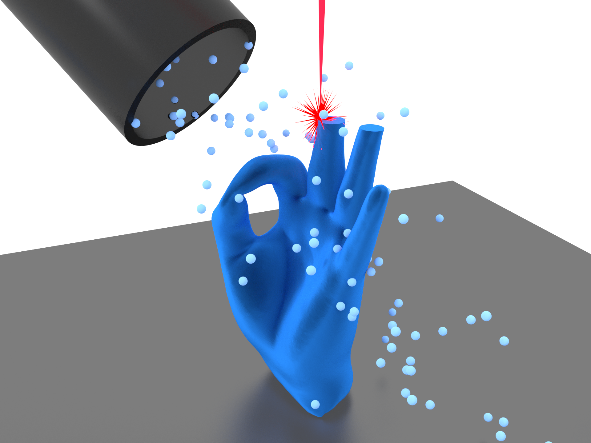

I completed my PhD in the field of 3D nanomagnetism in [Thin Film Magnetism group](https://www.tfm.phy.cam.ac.uk/). I was exploring how the structure geometry affects the magnetic properties of nanostructures. These structures and effects have a potential to be the platform for the future data storage and processing devices. 

I worked on fabrication of these devices, computational simulations and experimental measurements of their properties.

My thesis can be accessed [here](https://aspace.repository.cam.ac.uk/handle/1810/331543).

## FEBID
<!-- 
 
 -->

**Focused Electron Induced Deposition (FEBID)** is a technique I used in my research for 3D printing with a resolution of ~50nm, about 2,000 times better than conventional 3D printers. In it, gas molecules are injected inside electron microscope and are broken down by the electron beam, creating tiny deposits. By stacking these deposits, we can grow 3D structures 10 times smaller than human blood cells.

In December 2019, we have published a paper in which we show an approach to creating deposition patterns for FEBID from standard 3D printing CAD files, accounting for a number of effects that usually make the process too computationally intensive [4]. The simplified fabrication process now opens up a way to create (almost) arbitrary nanostructures.



   
   
   

[[1]](https://pubs.acs.org/doi/10.1021/acsanm.7b00342) J. D. Fowlkes et al., ACS Applied Nano Materials. 1, 1028–1041 (2018).

[[2]](https://www.mdpi.com/2079-4991/8/7/483) D. Sanz-Hernández et al., Nanomaterials. 8, 483 (2018).

[[3]](https://www.mdpi.com/1996-1944/13/17/3774) A. Fernández-Pacheco et al., Materials. 13, 3774 (2020).

[[4]](https://pubs.acs.org/doi/10.1021/acs.nanolett.9b03565) L. Skoric et al., Nano Lett. 20, 184–191 (2020).

## MOKE

When light reflects off of a magnetised material, there are small changes to the [polarization](https://en.wikipedia.org/wiki/Polarization_(waves)) of the light depending on the magnetisation of the material. This is known as **Magneto-optical Kerr Effect (MOKE)**, and we use it to measure the magnetisation of our samples.

A special type of MOKE-measurement system is required to study 3D nanostructures. For this purpose, we have built a customized optical setup which collects laser light reflected off a 3D structure from multiple angles. The so-called <b>3DMOKE</b> can apply magnetic fields in any direction and measure how different parts of the structure respond. 

I worked on designing and constructing the new-generation 3DMOKE. The system is managed by the software I wrote that controls the instruments, collects and synchonises the data and displays it in real time (snapshot below). The most demanding part of the software was designing the control system that adjusts for the hysteresis of the hexapole electromagnet to be able to apply field sequences with high accuracy.
   
   
   
   




## X-ray classification -> this needs updating

High-energy beams of X-Ray light are capable of kicking out electrons from materials. In **Photo Emission Electron Microscopy (PEEM)** we use this effect to take images of the magnetisation of samples. These measurements require synchrotron radiation to achieve necessary intensities. We are collaborating with the [Hermes beamline](https://www.synchrotron-soleil.fr/en/beamlines/hermes) in SOLEIL synchrotron to investigate the magnetic states in 3D structures.

